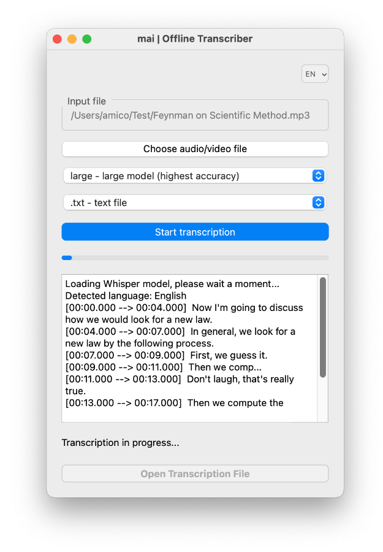

# mai | Offline Transcriber

**mai | Offline Transcriber** is an easy-to-use application for transcribing audio and video files that works completely offline and saves the transcription in txt or srt (subtitle for video) format. The application's operation ensures the privacy of your transcribed files, as no data is sent to any external servers. The application is ideal for users who need fast and secure transcription without worrying about the confidentiality of their data. For transcription, the application uses the Whisper model, downloaded and run locally on the user's computer. During the transcription, the application displays a transcription progress bar, as well as intermediate results returned to stdout by the whisper model - the application captures these and displays a preview in the application window.

## About the Whisper Model
The **mai | Offline Transcriber** application uses the **Whisper** model for transcription, developed by OpenAI. The model was made public in September 2022 under the MIT license, which allows its free use for both personal, non-commercial, and commercial purposes.

### Key Features and Security

*   **Offline Operation:** Whisper operates entirely offline. This means that your audio and video files are processed directly on your computer, without sending any data to external servers. This approach guarantees the privacy of your data, protecting it from potential disclosure during transmission.
*   **Privacy:** Since the transcription process takes place locally, your audio data remains completely confidential/private - it is not sent anywhere.
*   **No Internet Connection Required (After Initial Download):** After the initial download of the selected Whisper model, no internet connection is required to perform the transcription. All necessary files are stored locally on your computer.

### Choosing a Transcription Model

The application offers several variants of Whisper models, differing in size, which affects the trade-off between accuracy and speed:

*   **`tiny`**: The smallest and fastest model. Ideal for quick transcriptions if you are willing to accept a lack of accuracy and errors - but provides a quick overview of the recording content (approx. 75MB)
*   **`small`**: A small model that strikes a balance between speed and reasonable accuracy (approx. 483MB)
*   **`medium`**: A medium model offering higher accuracy at the cost of longer processing time, suitable for more precise transcriptions. (approx. 1.53GB)
*   **`large`**: The largest and most accurate model, but also the slowest - however, the transcription quality is usually very good, I recommend it :) (approx. 3.09GB)

### Model File Sizes and Caching

*   **File Sizes:** Model files vary in size, from relatively small (tens of MB for `tiny`) to very large (several GB for `large`). Larger models usually provide better transcription quality but require more disk space.
*   **First Download:** When selecting a given model for the first time, it may be necessary to download it from the internet. The application will inform you about this process. The download only occurs once for each model - afterwards the model will remain saved on your computer (unless you delete it :)
*   **Local Caching:** After downloading, models are stored locally on your computer until you manually delete them (e.g., in macOS, model files are saved in the `.cache/whisper/` folder). This means that subsequent transcriptions using the same model will load the model from this local folder.
*   **Faster Subsequent Runs:** Because models are cached locally, the waiting time for launching the next transcription will only include loading the model into the computer's memory. This is significantly faster than the first time.

## Application Features

*   **Offline Transcription:** File processing takes place locally on your computer, which ensures the privacy of transcribed data.
*   **Support for Various Audio/Video Formats:** The application supports a wide range of popular audio and video file formats (e.g., mp3, wav, mp4, mkv, avi, *.m4a *.m4b *.mka *.mp3 *.mp4 *.mpg *.mpeg *.oga *.ogg and many other types of multimedia files).
*   **Whisper Model Selection:** The ability to select different Whisper models (tiny, small, medium, large) depending on your needs (speed vs. accuracy).
*   **Available Output Formats:** Saving transcriptions in text format (`.txt`) or in subtitle format for videos (`.srt`).
*   **Multilingual Interface:** Support for Polish and English.
*   **Easy-to-Use Graphical Interface (GUI):** Intuitive operation, enabling fast transcription without the need for technical knowledge.

## Installation

### Requirements

*   **Python 3.8 or later:**
*   **pip:** Python package manager.
*   ffprobe 

### Required Python Packages

Install the required packages using `pip`:

```bash
pip install openai-whisper PyQt6
```

### Additional Tools

**ffprobe:** Is used to retrieve information about the length of audio and video files. Make sure ffprobe is available in your system's PATH. You can download it from the official FFmpeg website - [https://ffmpeg.org/download.html](https://ffmpeg.org/download.html).

-   **macOS:** You can install it using Homebrew, for example:
```
brew install ffmpeg
```

-   **Windows:** Download the binaries from the official FFmpeg website and add the directory with the binaries to the system PATH variable.

-   **Linux:** 
`sudo apt install ffmpeg` or `sudo yum install ffmpeg` or `sudo pacman -S ffmpeg` depending on your distribution.

### Running

The application can be launched on macOS and Windows using the following command:
```
python main.py
```

## Managing Interface Languages / Modifying the Application
The following information is not needed to use the application but may be useful if you want to modify it:
### Adding a New Language

- Create a .ts file: Use the lrelease tool from the Qt package to create a .ts file for the new language:
```
pylupdate6 gui.py -ts translations/language_name.ts
```

- Translate the .ts file: Open language_name.ts in Qt Linguist and translate all the texts.

- Compile to .qm: Use `lrelease` to compile the .ts file to .qm:

```
lrelease translations/language_name.ts -qm translations/language_name.qm
```

- Add support in the code: Modify the code in gui.py to support your new language. Add an appropriate entry to the language change menu (QMenu) and in change_language() add support for your language code.

- Load the translator: Make sure the translator is loaded when the application starts.

# Summary - Important Information

- Privacy: All data remains on your computer, which ensures the security of transcribed files.

- Whisper Models: The first run with a new model may require downloading model files from the internet. These files are stored locally in a folder (indicated by the whisper.utils.get_default_download_root() function).

- Performance: Transcription may take longer depending on the length of the file, the selected model, and your computer's processing power.

- ffprobe: Make sure ffprobe is correctly installed and added to your PATH.

- Performance: The transcription time depends on the file size and the computer's processing power.

# License
The application is provided under the MIT license