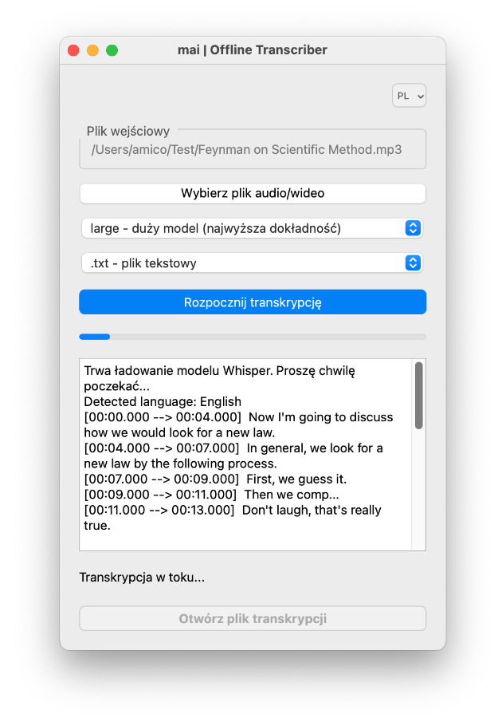

# mai | Offline Transcriber

**mai | Offline Transcriber** to prosta w obsłudze aplikacja do transkrypcji plików audio i wideo, która działa całkowicie offline i zapisuje transkrypcję w formacie txt lub srt (napisu do filmu). Sposób działania aplikacji zapewnia prywatność Twoich transkrybowanych plików, ponieważ dane nie są przesyłane do żadnych zewnętrznych serwerów. Aplikacja jest idealna dla użytkowników, którzy potrzebują szybkiej i bezpiecznej transkrypcji bez obaw o poufność swoich danych. Do wykonywania transkrypcji aplikacja wykorzystuje model Whisper pobrany i uruchamiany lokalnie na komputerze użytkownika. 
W trakcie tranksrypcji aplikacja wyświetla pasek postępu transkrypcji a również pośrednie wyniki, zwracane na stdout przez model whisper - aplikacja przechwytuje je i wyświetla podgląd w oknie aplikacji.

## O modelu Whisper
Aplikacja **mai | Offline Transcriber** wykorzystuje do transkrypcji model **Whisper**, opracowany przez OpenAI. Model został upubliczniony we wrześniu 2022 roku na licencji MIT, która umożliwia jego bezpłatne wykorzystywanie zarówno do celów osobistych, niekomercyjnych, jak i komercyjnych.

### Kluczowe cechy i bezpieczeństwo

*   **Działanie offline:** Whisper działa całkowicie offline. Oznacza to, że Twoje pliki audio i wideo są przetwarzane bezpośrednio na Twoim komputerze, bez wysyłania żadnych danych na zewnętrzne serwery. Takie podejście gwarantuje prywatność Twoich danych, chroniąc je przed potencjalnym ujawnieniem podczas transmisji.
*   **Prywatność:** Ponieważ proces transkrypcji odbywa się lokalnie, Twoje dane audio pozostają całkowicie poufne/prywatne - nie są nigdzie przesyłane. 
*   **Brak wymaganego połączenia z internetem (po pierwszym pobraniu):** Po pierwszym pobraniu wybranego modelu Whisper, do przeprowadzenia transkrypcji nie jest wymagane żadne połączenie z internetem. Wszystkie niezbędne pliki są przechowywane lokalnie na Twoim komputerze.


### Wybór modelu transkrypcji

Aplikacja oferuje kilka wariantów modeli whisper różniących się rozmiarem, co wpływa na kompromis między dokładnością a szybkością:

*   **`tiny`**: Najmniejszy i najszybszy model. Idealny do szybkich transkrypcji o ile jesteś w stanie pogodzić się z brakiem dokładności i błędami - ale daje jakiś szybko pogląd na treść nagrania (ok. 75MB)
*   **`small`**: Mały model, który stanowi kompromis między szybkością a rozsądną dokładnością (ok. 483MB)
*   **`medium`**: Średni model, oferujący wyższą dokładność kosztem dłuższego czasu przetwarzania, odpowiedni do bardziej precyzyjnych transkrypcji. (ok. 1,53GB)
*   **`large`**: Największy i najbardziej dokładny model, ale także najwolniejszy - za to jakość transkrypcji jest zazwyczaj naprawdę bardzo dobra, polecam:) (ok. 3,09GB)


### Rozmiar plików modeli i buforowanie

*   **Rozmiary plików**: Pliki modeli mają różną wielkość, od stosunkowo małych (kilkadziesiąt MB dla `tiny`) do bardzo dużych (kilka GB dla `large`). Większe modele zazwyczaj zapewniają lepszą jakość transkrypcji, ale wymagają więcej miejsca na dysku.
*   **Pierwsze pobieranie**: Przy pierwszym wyborze danego modelu może być konieczne jego pobranie z internetu. Aplikacja poinformuje Cię o tym procesie. Pobieranie odbywa się tylko raz dla każdego modelu - potem model pozostanie zapisany na Twoim komputerze (o ile go nie skasujesz:) 
*   **Lokalne buforowanie**: Po pobraniu modele są przechowywane lokalnie na Twoim komputerze dopóki ich nie usuniesz ręcznie (np. w MacOS pliki modeli są zapisywane w folderze `.cache/whisper/`)). Oznacza to, że kolejne transkrypcje przy użyciu tego samego modelu będą ładowały model z tego lokalnego folderu.
*   **Szybsze kolejne uruchomienia:** Ponieważ modele są buforowane lokalnie, czas oczekiwania na uruchomienie kolejnej transkrypcji będzie obejmował tylko załadowanie modelu do pamięci komputera. Jest to znacznie szybsze niż za pierwszym razem.


## Funkcje aplikacji

*   **Transkrypcja offline:** Przetwarzanie plików odbywa się lokalnie na Twoim komputerze, co zapewnia prywatność transkrybowanych danych.
*   **Obsługa różnych formatów audio/wideo:** Aplikacja obsługuje szeroki zakres popularnych formatów plików audio i wideo (np. mp3, wav, mp4, mkv, avi, *.m4a *.m4b *.mka *.mp3 *.mp4 *.mpg *.mpeg *.oga *.ogg i wiele innych typów plików multimedialnych).
*   **Wybór modelu Whisper:** Możliwość wyboru różnych modeli Whisper (tiny, small, medium, large) w zależności od potrzeb (szybkość vs. dokładność).
*   **Dostępne formaty wyjściowe:** Zapis transkrypcji w formacie tekstowym (`.txt`) lub w formacie napisów do filmów (`.srt`).
*   **Wielojęzyczny interfejs:** Obsługa języka polskiego i angielskiego.
*   **Łatwy w użyciu interfejs graficzny (GUI):** Intuicyjna obsługa, umożliwiająca szybką transkrypcję bez konieczności znajomości technicznych szczegółów.


## Instalacja

### Wymagania

*   **Python 3.8 lub nowszy:**
*   **pip:**  Menadżer pakietów Pythona.
*   ffprobe 

### Potrzebne pakiety Pythona

Zainstaluj wymagane pakiety za pomocą `pip`:

```bash
pip install openai-whisper PyQt6
```

### Dodatkowe narzędzia

**ffprobe:** Jest używany do pobierania informacji o długości plików audio i wideo. Upewnij się, że ffprobe jest dostępne w twoim systemowym PATH. Możesz go pobrać z oficjalnej strony FFmpeg - [https://ffmpeg.org/download.html](https://ffmpeg.org/download.html).

- **macOS:** Możesz go zainstalować np. za pomocą Homebrew:
```
brew install ffmpeg
```

- **Windows:** Pobierz binaria z oficjalnej strony FFmpeg i dodaj katalog z binariami do systemowej zmiennej PATH.

- **Linux:** 
`sudo apt install ffmpeg` lub `sudo yum install ffmpeg` lub `sudo pacman -S ffmpeg` w zależności od dystrybucji.


### Uruchamianie

Aplikację można uruchomić na systemach macOS i Windows za pomocą następującego polecenia:
```
python main.py
```


## Zarządzanie językami interfejsu / modyfikacja aplikacji
Poniższe informacje nie są potrzebne do korzystania z aplikacji ale mogą Ci się przydać jeśli chcesz ją modyfikować:
### Dodawanie nowego języka

- Utwórz plik .ts: Użyj narzędzia lrelease z pakietu Qt, aby utworzyć plik .ts dla nowego języka:
```
pylupdate6 gui.py -ts translations/symbol_języka.ts
```

- Przetłumacz plik .ts: Otwórz nazwa_języka.ts w Qt Linguist i przetłumacz wszystkie teksty.

- Skompiluj do .qm: Użyj `lrelease`, aby skompilować plik .ts do .qm:

```
lrelease translations/nazwa_języka.ts -qm translations/symbol_języka.qm
```

- Dodaj obsługę w kodzie: Zmodyfikuj kod w gui.py, aby obsługiwał Twój nowy język. Dodaj odpowiedni wpis do menu zmiany języka (QMenu) i w change_language() dodaj obsługę swojego kodu języka.

- Załaduj translator: Upewnij się, że tłumacz jest ładowany podczas uruchamiania aplikacji.


# Podsumowanie - ważne informacje

- Prywatność: Wszystkie dane pozostają na Twoim komputerze, co zapewnia bezpieczeństwo transkrybowanych plików.

- Modele Whisper: Pierwsze uruchomienie z nowym modelem może wymagać pobrania plików modelu z internetu. Te pliki są przechowywane lokalnie w folderze (wskazywanym przez funkcję whisper.utils.get_default_download_root()).

- Wydajność: Transkrypcja może trwać dłużej w zależności od długości pliku, wybranego modelu i mocy obliczeniowej komputera.

- ffprobe: Upewnij się, że ffprobe jest poprawnie zainstalowane i dodane do PATH.

- Wydajność: Długość transkrypcji zależy od wielkości pliku i mocy obliczeniowej komputera.


# Licencja 
Aplikacja jest udostępniona na licencji MIT